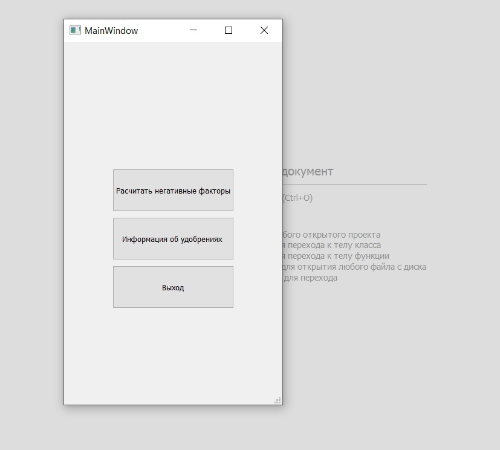
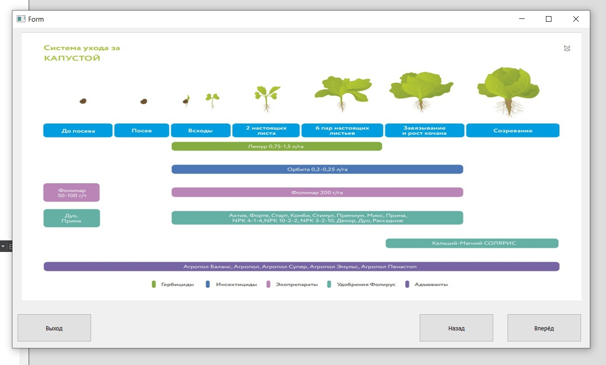
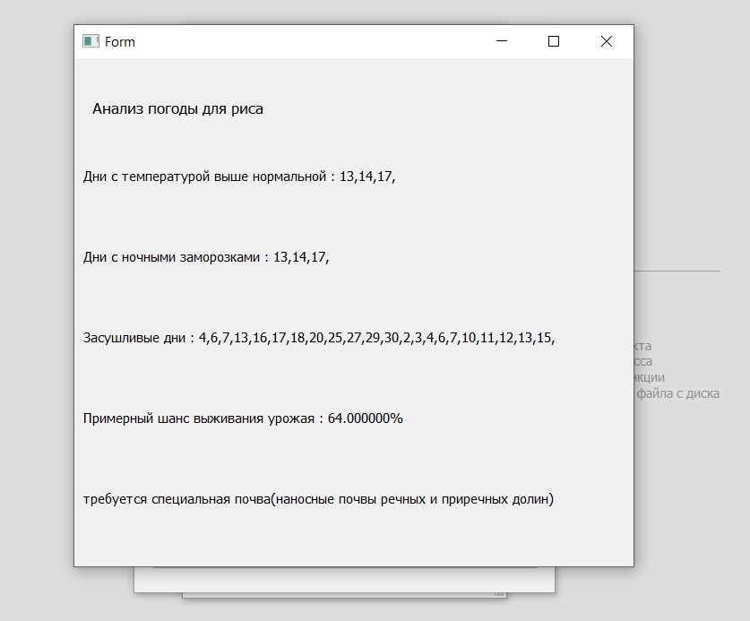
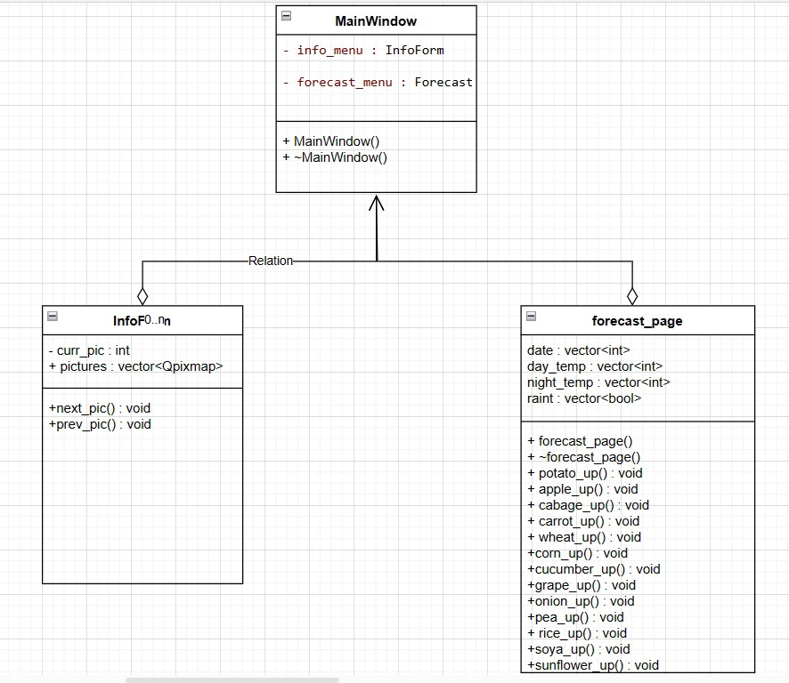

# Автоматизированное рабочее место специалиста
## Постановка задачи
Реализовать автоматизированное рабочее место специалиста (АРМ) - агронома. Программа должна выполнять следующие функции:

Предоставление пользователю структурированной информации об удобрениях
Анализ прогноза погоды на предмет опасных дней для каждого растения
## Анализ задачи
Релизуем считывание информации о дневной температуры, ночной температуры и дожде из текстового файла
Вывод схемы удобрений реализуем выводом изображения на label
По алгоритму расчиаем прогноз для каждого растения
## Результат работы программы

Рис. 1 - Стартовое меню.

Рис. 2 - Окно с информацией по химикатам.

Рис. 3 - Окно с прогнозом.
## UML диаграмма

## Исходный код
Исходный код представлен в репозитории: https://github.com/Pave1Tokarev/ARM-and-Salesman/tree/main/ARM/farmarm
