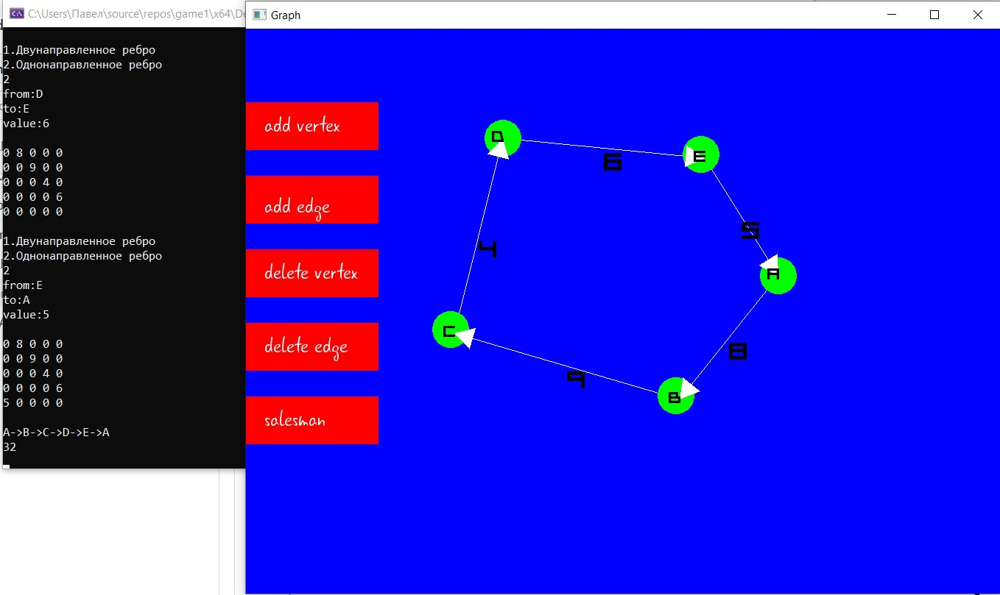
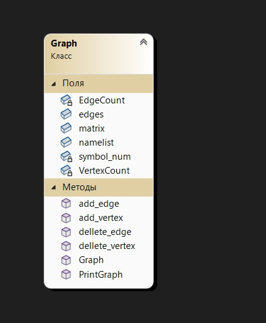

# Задача комивояжера
## Постановка задачи
Реализовать граф и решить для него задачу Комивояжера методом ветвей и границ. Для решения данной задачи необходимо:
Создать класс Graph.
Визуализировать граф
Решить задачу комивояжёра

## Анализ задачи
Базовый класс Graph взят из лабораторной работы графы. Граф хранится в виде массива с наименованием вершин и матрицы смежности. В графе реализованы методы для создания вершин, направленных и ненаправленных ребер.
Для решения задачи комивояжера использован метод ветвей и границ, который находит локально-оптимальное решение для данного графа. 
Для визуализации использована библиотека SFML Вершины графа отрисовываются в случайной точке, после чего их новое местоположение можно задать передвижением мыши.
## Тестирование
Для тестирования программы необходимо выполнить тесты решения задачи и визуализации на разном количестве вершин, а также на разных типах ребрах. Тестирование программы представленно в видео на YouTube: [https://youtu.be/yMU_4ZuSATE](https://www.youtube.com/watch?v=ou-pzoeFYTw&t=3s&ab_channel=ja13k0)
## Результаты работы программы

Рис. 1 - Результат работы программы.
## Диаграмма UML

Рис. 2 - Диаграмма классов.
## Исходный код
Исходный код представлен в репозитории: https://github.com/Pave1Tokarev/ARM-and-Salesman/tree/main/Salesman
